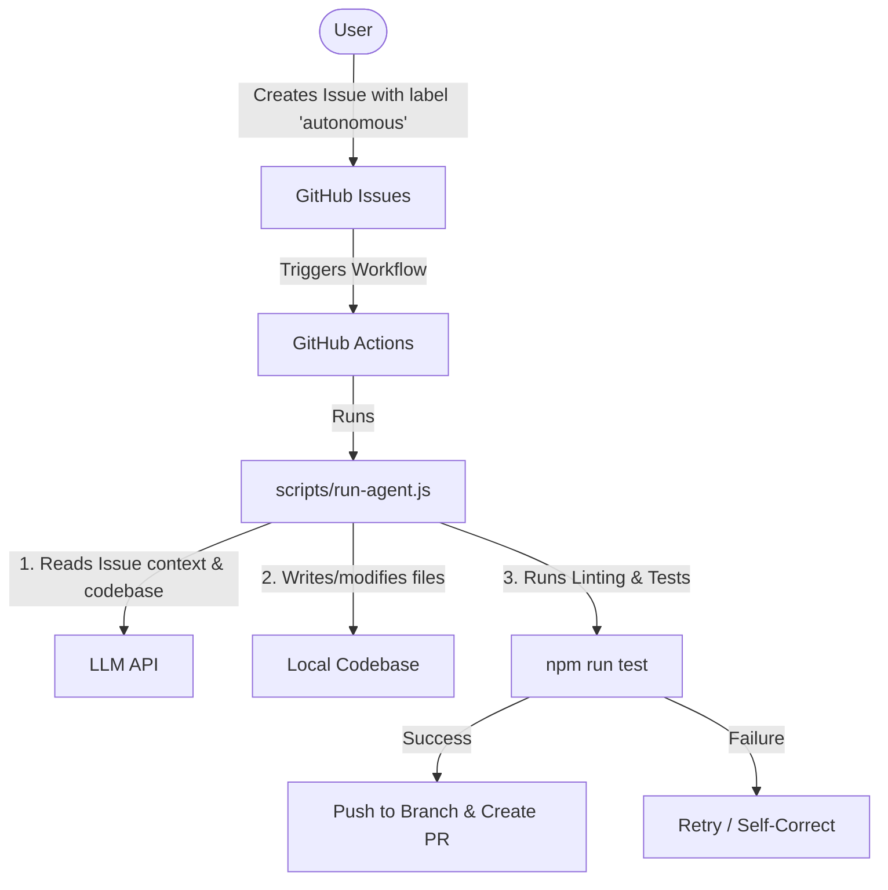

# agy-sandbox

An experimental sandbox environment optimized for **maximum no-human-in-the-loop, fully autonomous coding**.

This repository is built to empower AI developers (like AGY and GitHub Actions bots) to build, test, and maintain features autonomously.

---

## 🤖 The Autonomous Framework

We utilize a robust closed-loop workflow to safely delegate software development tasks directly to AI agents:



1. **Issue Trigger**: The user opens a task in GitHub Issues and adds the `autonomous` label.
2. **Action Dispatch**: GitHub Actions initiates the autonomous worker.
3. **Execution & Self-Correction**: The agent writes code, formats it, and runs ESLint and Jest unit tests. If tests fail, it self-corrects using logs.
4. **Pull Request Submission**: Upon a successful, passing build, the agent pushes a feature branch and creates a new PR for automated merging.

---

## 🛠️ Getting Started

### Local Setup

1. Clone the repository (already done!):
   ```bash
   git clone https://github.com/michaelcrosato/agy-sandbox.git
   cd agy-sandbox
   ```
2. Install dependencies:
   ```bash
   npm install
   ```
3. Run the test suite:
   ```bash
   npm test
   ```
4. Run code quality checks:
   ```bash
   npm run lint
   ```

### Running the Autonomous Agent Locally

If you want to trigger the agent loop manually from your local machine:

```bash
# Set your API key and issue number
$env:GEMINI_API_KEY="your-gemini-api-key"
$env:GITHUB_TOKEN="your-github-token"
node scripts/run-agent.js --issue <issue_number>
```

---

## 📋 Directory Structure

- `.github/workflows/` — Continuous Integration and autonomous agent workflows.
- `.github/AGENT_RULES.md` — Behavior rules, constraints, and standard operating procedures for the agent.
- `scripts/run-agent.js` — The orchestrator script that drives the agent loop.
- `src/` — Source code for projects and tasks.
