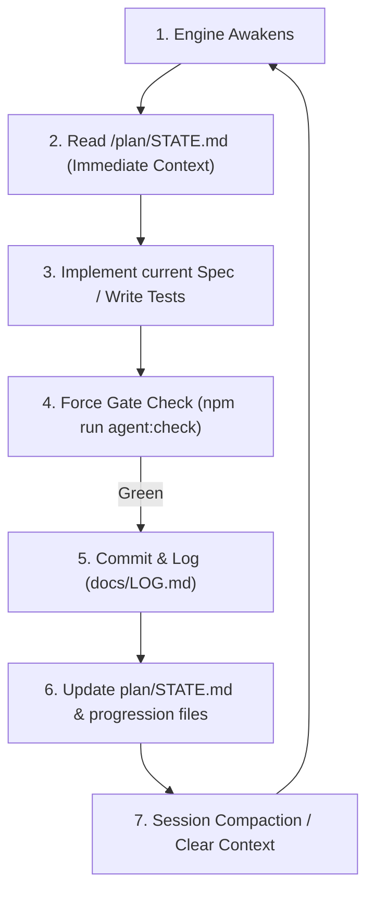

# THE UNATTENDED AFK LOOP SYSTEM

This document outlines the architecture, setup, and execution guidelines for running the **Starfall Unattended (AFK) Coding Loop** at maximum token-efficiency and reasoning depth.

---

## 1. The Token-Efficiency & Compaction Blueprint

To prevent context window bloat and avoid token drift over long runs, we separate memory into two tiers:
1. **Long-Term Specification Memory:** Contained inside `plan/specs/`, `plan/ROADMAP.md`, and `plan/PROGRESS.md`.
2. **Dynamic High-Compression State Anchor:** Contained inside `/plan/STATE.md`.

### The Loop Execution Sequence:


---

## 2. Unattended AFK Execution Scripts

To run this loop endlessly on your system, we provide a cross-platform daemon script that executes the machine cycles, runs BIOS checks, launches the LLM runtime engine, checks validation, and rolls back on failure.

### PowerShell Script (Windows): `scripts/run-afk-loop.ps1`
Run from the repository root:
```powershell
powershell -NoProfile -ExecutionPolicy Bypass -File ./scripts/run-afk-loop.ps1
```

### Bash Script (POSIX): `scripts/run-afk-loop.sh`
Run from the repository root:
```bash
chmod +x scripts/run-afk-loop.sh
./scripts/run-afk-loop.sh
```

---

## 3. Downstream Agent Operational Mandate

When you awaken inside this loop:
1. **Load State First:** Do NOT blind-scan all source files. Open and parse `/plan/STATE.md` immediately to orient yourself.
2. **Execute atomics:** Work ONLY on the `CURRENT_TASK` specified in the state.
3. **Commit Cleanly:** Commit only when the verification gate passes with exit code 0.
4. **Update & Compress:** After finishing a task, choose the next unblocked task, update `/plan/STATE.md` to the next ticket, and clear non-essential details.
