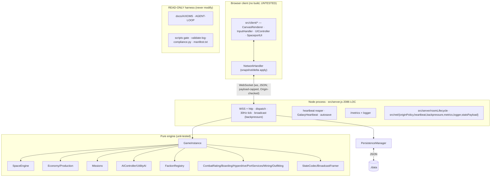

# ROADMAP — Audit-Driven Development Blueprint (v2 · 2026-05-29)

Refreshed after **Phase 0 + all of Phase 1 shipped** (specs 001–013). This is the **execution order**
for downstream agents. Atomic work lives in [`specs/`](specs/); status in [`PROGRESS.md`](PROGRESS.md);
runtime rules in [`AGENTS.md`](AGENTS.md). Product North Star + pillars (P1–P8): [`../docs/GOAL.md`](../docs/GOAL.md).

> **What changed since v1:** the repo went from 569 tests / 33 suites with 2 high CVEs and a raw,
> unhardened socket server to **614 tests / 42 suites, 0 CVEs**, with ws hardening (payload cap, Origin
> check, heartbeat, backpressure), `/metrics` observability, a partially-modularized server, ESLint 10
> + Jest 30, and the GitHub agent on `@google/genai`. The remaining work is the **Phase 2 features** plus
> a small **continued-hardening / 2026-modernization** wave surfaced by this re-audit.

---

## REPO BASELINE (measured 2026-05-29, HEAD `9bb7098` on `main`)

**Core purpose.** `Starfall: Living Galaxy` — a browser-native, authoritative-server **multiplayer
space trading & combat sim**, inside a self-directed autonomous-engineering harness.

| Dimension | Value |
| --- | --- |
| Runtime | Node.js (ESM, `engines >=20`; Active LTS is **Node 24**, Maintenance is 22) |
| Server | `ws` 8.21 + `http` (`src/server.js`, **2,086 LOC**; partially extracted) + `src/server/*`, `src/net/*` |
| Client | Vanilla JS + Canvas 2D (`src/main.js`, `src/client/*`), no framework/bundler/TS |
| Engine | Pure/headless, fully unit-tested: `src/engine`, `src/physics`, `src/net`, `src/persistence` |
| Data | JSON-file persistence (`JsonFileStore` → `./data`), in-memory rooms; **no DB** |
| Build | none (static + node) · **Typecheck:** none (plain JS + JSDoc) |
| Tests | Jest **30.4**, **614 passing / 42 suites**; engine/net/persistence well covered |
| Lint/format | ESLint **10.4** (flat) + Prettier, clean. Gate: `npm run agent:check` |
| Security | `npm audit` **0 vulnerabilities**; ws payload-capped + Origin-checked + heartbeat + backpressure |
| Observability | `GET /metrics` (counters/gauges/observations) + structured JSON logger |
| CI | `.github/workflows/ci.yml` — prettier → eslint → jest on **Node 20 only** |

**Architecture (monolith, single process, multi-room):**

**Operational-health findings (this re-audit):**
- ✅ **Resolved since v1:** axios/localtunnel CVEs, ws hardening, observability, NaN economy hygiene,
  persistence restart test, role-based threat detection, ESLint 10 / Jest 30, `@google/genai`.
- ⚠️ **Client is the untested surface:** `src/client/*` (5 files: CanvasRenderer, InputHandler,
  NetworkHandler, SpaceportUI, UIController) + `src/main.js` have **no tests** (`specs/021`).
- ⚠️ **Duplication debt:** the `boarding_action` **salvage** branch still inlines a `defaultCatalog`
  and outfit logic that duplicates `engine/Outfitting.applyOutfitStats` (`specs/020`).
- ⚠️ **`server.js` still 2,086 LOC** — extraction (007) started; the message-dispatch handlers remain
  inline/untested (`specs/025`).
- ⚠️ **CI on Node 20 only** while Active LTS is 24 — no version matrix (`specs/022`).
- ⚠️ **No typecheck** — JSDoc types aren't verified (`specs/024`); `dotenv` 16→17 pending (`specs/023`).
- ⏳ **Phase 2 features unbuilt:** interest management, binary protocol, faction/NPC runtime wiring,
  production chains, horizontal scaling (`specs/014–019`).

---

## PHASE 2 RESEARCH SYNTHESIS (2026)

- **Node.js:** Active LTS = **Node 24** (supported to Apr 2028); 22 is Maintenance; 26 enters LTS Oct
  2026. Production should run an LTS — so CI should at least matrix **20 → 22 → 24** and the floor should
  track an LTS (`specs/022`).
- **Client testing (canvas/browser):** the 2026 standard is **Vitest Browser Mode** (tests run in real
  Chromium via a Playwright provider; ~30% faster than classic Playwright E2E) or **Playwright
  component/E2E**, with **visual-regression snapshots** for canvas. This is the validated path to finally
  cover `src/client/*` (`specs/021`).
- **Competitive landscape (recap):** **Colyseus** (binary delta sync + Redis scaling to 10k+ CCU) is the
  market reference; **geckos.io** (WebRTC/UDP) for lower latency; **Hathora** for serverless rooms.
  Starfall still hand-rolls rooms/codec and lacks interest management, a binary protocol, and horizontal
  scaling — the `specs/014/015/019` gap.
- **Vulnerabilities:** `npm audit` is clean; `ws` 8.21, ESLint 10, Jest 30, `@google/genai` are current.
  Keep the lockfile clean (`npm ci`) as the standing supply-chain control.

---

## EXECUTION WAVES

Phase 0 + Phase 1 are **complete** (kept for context). The live work is Wave A then Phase 2.

### ✅ Phase 0 — Quick Wins & Safety (DONE) — `001`–`006`
### ✅ Phase 1 — Core Upgrades (DONE) — `007`–`013`

### Wave A — Continued hardening & 2026 modernization (NEW)
`020` salvage outfit dedup · `021` client test harness · `022` CI Node LTS matrix · `023` dotenv 17 ·
`024` JSDoc typecheck gate · `025` continue server.js extraction.

### Phase 2 — Major Features (netcode + simulation depth + scale)
`014` interest management · `015` binary wire protocol · `016` faction runtime wiring · `017`
goal-driven NPCs · `018` production chains + ore commodity · `019` horizontal scaling.

---

## MASTER PRIORITIZATION TABLE (remaining work)

Scores 1–5 (5 = best). Risk: 5 = low risk. Σ = Impact + Feasibility + Risk + Fit.

| Spec | Title | Wave | Impact | Feasibility | Risk(5=safe) | Fit | Σ |
| --- | --- | :-: | :-: | :-: | :-: | :-: | :-: |
| 020 | Salvage outfit dedup (→ applyOutfitStats) | A | 3 | 5 | 5 | 5 | 18 |
| 022 | CI Node LTS matrix (20/22/24) | A | 4 | 5 | 5 | 5 | 19 |
| 023 | dotenv 16→17 bump | A | 2 | 5 | 5 | 5 | 17 |
| 021 | Client test harness (Vitest/Playwright) | A | 5 | 3 | 4 | 4 | 16 |
| 024 | JSDoc typecheck gate (tsc --noEmit) | A | 3 | 3 | 4 | 4 | 14 |
| 025 | Continue server.js extraction (handlers) | A | 4 | 2 | 3 | 4 | 13 |
| 016 | Faction runtime wiring (P3) | 2 | 4 | 3 | 3 | 4 | 14 |
| 017 | Goal-driven NPC runtime (P5) | 2 | 4 | 3 | 3 | 4 | 14 |
| 014 | Interest management (AoI) | 2 | 5 | 3 | 3 | 4 | 15 |
| 015 | Binary wire protocol (P7) | 2 | 4 | 2 | 3 | 3 | 12 |
| 018 | Production chains + ore (P2) | 2 | 4 | 2 | 3 | 3 | 12 |
| 019 | Horizontal scaling (multi-process/Redis) | 2 | 5 | 1 | 2 | 2 | 10 |

**Recommended start:** `022` then `020` (Σ19/18, both small + safe), then `021` (highest impact — finally
covers the client). Then product value: `016`/`017` runtime wiring, then the netcode `014`/`015`, with
`019` as the North-Star epic (decompose, don't build-as-one).

## Risks & guardrails
- **Substrate is read-only** (`AGENTS.md §0`) — never modify.
- Client is not headlessly testable today — `021` introduces a real-browser harness; until then verify UI
  by booting `node src/server.js`.
- A parallel/rogue writer corrupted `docs/LOG.md` once (recovered, iter-0037) — **serialize ledger edits**
  and always anchor on the standalone `== LOG-ANCHOR ==` line, never the first substring match.
- Every spec lands behind a green `npm run agent:check`; nothing pushed without authorization.
