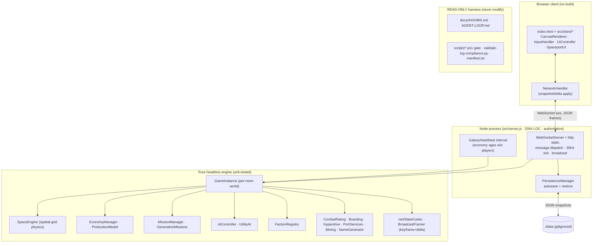

# ROADMAP — Audit-Driven Development Blueprint

Generated 2026-05-28 from a full repository audit + 2026 ecosystem research. This is the **execution
order** for downstream agents. Atomic work lives in [`specs/`](specs/); status in
[`PROGRESS.md`](PROGRESS.md); runtime rules in [`AGENTS.md`](AGENTS.md). The product North Star and
pillars (P1–P8) remain in [`../docs/GOAL.md`](../docs/GOAL.md); this blueprint maps engineering work
onto them and is not a replacement.

---

## REPO BASELINE

**Core purpose.** `Starfall: Living Galaxy` — a browser-native, real-time **multiplayer space
trading & combat sim** on an authoritative Node WebSocket server, wrapped in a self-directed
autonomous-engineering harness (`docs/` + `scripts/` substrate). North Star: "a galaxy alive without you."

**Tech stack & scale (measured 2026-05-28):**

| Dimension | Value |
| --- | --- |
| Runtime | Node.js (local v24.15; CI Node 20), ESM (`"type":"module"`) |
| Server | `ws` 8.20.1 WebSocket + Node `http` static server (`src/server.js`, **2,054 LOC, untested**) |
| Client | Vanilla JS + Canvas 2D (`src/main.js`, `src/client/*`), no framework, no bundler |
| Engine | Pure/headless: `src/engine`, `src/physics`, `src/net`, `src/persistence` |
| Data layer | JSON-file persistence (`JsonFileStore` → `./data`), in-memory rooms; **no DB** |
| Build | **None** (static + node) | 
| Tests | Jest 29.7, **569 passing / 33 suites** (~8.5k LOC of tests over 34 modules / ~10.2k src LOC) |
| Lint/format | ESLint 9 (flat) clean; Prettier clean. Gate: `npm run agent:check` |
| Runtime deps | `ws`, `localtunnel` |
| CI | `.github/workflows/ci.yml` (prettier --check → eslint → jest on Node 20) |

**Architecture (monolith, single process, multi-room):**

**Operational-health findings (audit):**
- **Security (HIGH):** `localtunnel@2.0.2` pulls **`axios@0.21.4`** → 2 high-severity advisories (14 axios CVEs: SSRF, prototype pollution, DoS, header injection). See `specs/001`.
- **Security/robustness (ws):** `new WebSocketServer({ server })` has **no `maxPayload`** (inbound DoS), **no Origin/`verifyClient`** (cross-site WebSocket hijacking), **no connection heartbeat** (dead-socket leak), and broadcast ignores **backpressure** (`ws.send` return / `bufferedAmount`). See `specs/002–004`.
- **Structural debt:** `src/server.js` is a 2,054-line untested monolith — the highest regression-risk surface. See `specs/007`.
- **Test shortfall:** engine is well covered; **server + client are not** unit-tested; no kill→restart→rejoin integration test for P1 persistence (`specs/008`).
- **Observability gap:** `console.*` only; no structured logs, no runtime metrics (CCU, tick time, bandwidth). See `specs/010`.
- **Latent bug class:** non-finite economy values aren't self-healed and heartbeat diffusion can still propagate them (`specs/006`).
- **Stale toolchain:** ESLint 9→10, Jest 29→30 majors; `@google/generative-ai` superseded by `@google/genai`; `ws` 8.20→8.21 patch.

---

## PHASE 2 RESEARCH SYNTHESIS (2026)

**Competitive landscape.** The market-standard for this exact utility (Node authoritative realtime
multiplayer) is **Colyseus** — binary-encoded, delta-compressed automatic state sync, room-based
matchmaking + reconnection, and Redis-backed horizontal scaling to 10k+ CCU. **geckos.io** uses
**WebRTC/UDP** (unreliable channels) for lower latency than TCP WebSocket. **Hathora** provides
on-demand serverless room hosting. Reference netcode doctrine (Gambetta, Valve): authoritative
server + **client-side prediction**, **server reconciliation**, **entity interpolation**, **delta
compression**, and **interest management (area-of-interest)**. Starfall hand-rolls rooms + a
keyframe/delta codec (✓) but **lacks interest management, a binary protocol, prediction/reconciliation
depth, and horizontal scaling** — the gap vs. market leaders (`specs/014, 015, 019`).

**2026 stack best practices.** `ws` production baseline: cap `maxPayload`; validate `Origin`;
ping/pong heartbeat to reap dead sockets; honor backpressure (`bufferedAmount`/`send` callback) and
drop or disconnect slow clients; keep heavy CPU off the event loop. Node 20/22 LTS + ESM; pin engines.

**Vulnerabilities/CVEs.** `axios@0.21.4` (via localtunnel) carries unpatched SSRF/DoS/proto-pollution
advisories — open in localtunnel for ~2 years. Separately, a **March 2026 axios npm supply-chain
attack** poisoned versions 1.14.1/0.30.4 with a RAT (attributed to a NK state actor) — mitigated by a
clean lockfile (`npm ci`) + `overrides` pinning, and by removing unnecessary axios-bearing deps. The
safe move is to drop `localtunnel` from runtime deps (lazy/optional) and recommend `cloudflared`/`ngrok`.

---

## EXECUTION WAVES

Work top-down. A wave's specs are independent unless a spec's "Blocked by" says otherwise.

### Phase 0 — Quick Wins & Safety (do first; small, high-confidence)
`001` localtunnel/axios CVE · `002` ws inbound hardening · `003` ws heartbeat · `004` ws backpressure ·
`005` dependency hygiene · `006` economy NaN self-heal.

### Phase 1 — Core Upgrades (structure, coverage, toolchain)
`007` modularize `server.js` · `008` persistence restart integration test · `009` decouple threat
detection from names · `010` observability/metrics · `011` ESLint 10 · `012` Jest 30 · `013` Google
GenAI SDK migration.

### Phase 2 — Major Features (netcode + simulation depth + scale)
`014` interest management · `015` binary wire protocol · `016` faction runtime wiring · `017`
goal-driven NPCs · `018` production chains + ore commodity · `019` horizontal scaling.

---

## MASTER PRIORITIZATION TABLE

Scores 1–5 (5 = best). **Impact** = value delivered; **Feasibility** = ease/speed; **Risk** =
safety (5 = low risk); **Fit** = alignment with current architecture. Priority = sort by phase, then
by (Impact + Feasibility + Risk + Fit).

| Spec | Title | Phase | Impact | Feasibility | Risk(5=safe) | Fit | Σ |
| --- | --- | :-: | :-: | :-: | :-: | :-: | :-: |
| 001 | Remediate localtunnel/axios CVEs | 0 | 5 | 4 | 4 | 5 | 18 |
| 005 | Dependency hygiene (ws 8.21, engines, http-server) | 0 | 3 | 5 | 5 | 5 | 18 |
| 006 | Economy NaN self-heal + heartbeat guard | 0 | 4 | 5 | 5 | 5 | 19 |
| 002 | ws inbound hardening (maxPayload + Origin) | 0 | 5 | 5 | 4 | 5 | 19 |
| 003 | ws connection heartbeat / reaper | 0 | 4 | 4 | 5 | 5 | 18 |
| 004 | ws outbound backpressure | 0 | 4 | 3 | 4 | 4 | 15 |
| 008 | Persistence restart integration test | 1 | 4 | 4 | 5 | 5 | 18 |
| 009 | Decouple threat detection from names | 1 | 4 | 4 | 4 | 4 | 16 |
| 010 | Observability: structured logs + metrics | 1 | 4 | 3 | 5 | 4 | 16 |
| 007 | Modularize server.js | 1 | 5 | 2 | 3 | 4 | 14 |
| 013 | Google GenAI SDK migration | 1 | 2 | 4 | 5 | 5 | 16 |
| 011 | ESLint 9→10 | 1 | 2 | 4 | 4 | 5 | 15 |
| 012 | Jest 29→30 | 1 | 2 | 3 | 4 | 5 | 14 |
| 014 | Interest management (AoI delta filtering) | 2 | 5 | 3 | 3 | 4 | 15 |
| 016 | Faction runtime wiring (P3) | 2 | 4 | 3 | 3 | 4 | 14 |
| 017 | Goal-driven NPC runtime (P5) | 2 | 4 | 3 | 3 | 4 | 14 |
| 015 | Binary wire protocol (P7) | 2 | 4 | 2 | 3 | 3 | 12 |
| 018 | Production chains + ore commodity (P2) | 2 | 4 | 2 | 3 | 3 | 12 |
| 019 | Horizontal scaling (multi-process/Redis) | 2 | 5 | 1 | 2 | 2 | 10 |

**Recommended start:** `002` and `006` (tied highest Σ=19, both small + safe + high-impact), then the
rest of Phase 0. `019` is the highest-impact long-term lever but the lowest feasibility/fit — treat as
a North-Star epic, not a near-term task.

## Risks & guardrails
- **Substrate is read-only** (`AGENTS.md` §0 / `docs/AGENT-LOOP.md`) — never touch.
- `server.js` is large & untested — change surgically; `specs/007` de-risks future work there.
- Client is not headlessly testable — verify UI by booting `node src/server.js`.
- Every spec lands behind a green `npm run agent:check`; nothing pushed without authorization.
