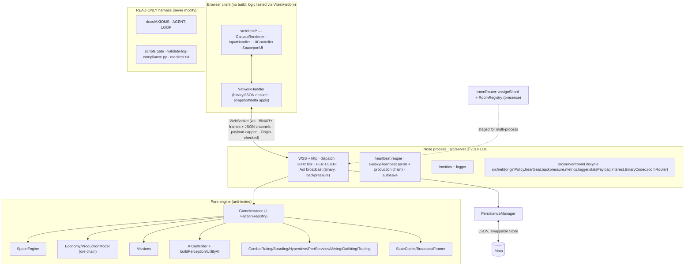

# ROADMAP — Audit-Driven Development Blueprint (v3 · 2026-05-30)

Refreshed after the **entire v2 blueprint shipped** — Phase 0 (`001–006`), Phase 1 (`007–013`), Wave A
(`020–025`), and all of Phase 2 (`014–019`) are **DONE and green**. This is the **execution order** for the
next cycle. Atomic work lives in [`specs/`](specs/); status in [`PROGRESS.md`](PROGRESS.md); runtime rules
in [`AGENTS.md`](AGENTS.md). Product North Star + pillars (P1–P8): [`../docs/GOAL.md`](../docs/GOAL.md).

> **What changed since v2:** the repo went from 614 tests / 42 suites (netcode/sim features unbuilt) to
> **696 Jest tests / 51 suites + 17 client tests, 0 CVEs**, now shipping per-client **interest management**
> (AoI), a **binary wire protocol** (key-dictionary codec), **faction runtime wiring** (standings drive
> prices + NPC targeting + docking), **goal-driven NPCs** (UtilityAI advisor), a **production chain** (raw
> `ore` → refined goods), a **client test harness** (Vitest+jsdom), an **engine typecheck gate** (scoped),
> a **CI Node LTS matrix**, and the **horizontal-scaling first slice** (router + shared-store proof +
> decomposition). The remaining work is a **continued-hardening / 2026-modernization** wave, a set of
> **debt-paydown** items surfaced by this re-audit + `BACKLOG.md`, and the **scaling build-out** (`019b–f`)
> plus competitive features.

---

## REPO BASELINE (measured 2026-05-30, HEAD `ac7461b` on `main`)

**Core purpose.** `Starfall: Living Galaxy` — a browser-native, authoritative-server **multiplayer space
trading & combat sim**, inside a self-directed autonomous-engineering harness.

| Dimension     | Value                                                                                                                                                             |
| ------------- | ----------------------------------------------------------------------------------------------------------------------------------------------------------------- | ------- | -------------------------------- |
| Runtime       | Node.js (ESM, `engines >=20`; **Active LTS = Node 24**, Maintenance = 22, **Current = 26**, Node 20 ≈ EOL)                                                        |
| Server        | `ws` 8.21 + `http` (`src/server.js`, **2,014 LOC**; partially extracted) + `src/server/*`, `src/net/*` (11 modules)                                               |
| Client        | Vanilla JS + Canvas 2D (`src/main.js`, `src/client/*`), no framework/bundler/TS                                                                                   |
| Engine        | Pure/headless, fully unit-tested: `src/engine` (24) + `engine/ai` (3), `src/physics`, `src/net`, `src/persistence`                                                |
| Netcode       | snapshot/delta (`StateCodec`) + per-client **AoI** (`interest.js`) + **binary** wire (`BinaryCodec`) + `BroadcastFramer`; `roomRouter` (shard/registry) for scale |
| Data          | JSON-file persistence (`JsonFileStore` → `./data`; swappable `Store`), in-memory rooms; **no DB**                                                                 |
| Build         | none (static + node) · **Typecheck:** `tsc --noEmit` checkJs over `src/net                                                                                        | physics | server` (engine ratchet pending) |
| Tests         | Jest **30.4** = **696 / 51 suites**; Vitest+jsdom **17 client**; `npm run test:client` separate                                                                   |
| Lint/format   | ESLint **10.4** (flat) + Prettier, clean. Gate: `npm run agent:check` (= prettier + eslint + typecheck + jest)                                                    |
| Security      | `npm audit` **0 vulnerabilities**; ws payload-capped + Origin-checked + heartbeat + backpressure; ws `^8.21` > CVE-2026-45736 floor (8.20.1)                      |
| Observability | `GET /metrics` (counters/gauges/observations) + structured JSON logger                                                                                            |
| CI            | `.github/workflows/ci.yml` — prettier → eslint → typecheck → jest on **Node 20/22/24** + a separate `client-tests` job                                            |
| Scale (LOC)   | 16.1k src JS / 10.4k test JS · 51 modules · 53 test files                                                                                                         |

**Architecture (monolith, single process, multi-room; scaling primitives staged):**

**Operational-health findings (this re-audit):**

- ✅ **Resolved since v2:** AoI filtering, binary protocol, faction wiring, goal-driven NPCs, ore production
  chain, client test harness, typecheck gate (scoped), CI LTS matrix, scaling first slice.
- ⚠️ **`server.js` grew back to 2,014 LOC** — the faction/AoI/binary wiring re-thickened the monolith;
  more message handlers remain inline/untested (`specs/034`).
- ⚠️ **Typecheck covers only `net|physics|server`** — `src/engine` + `src/persistence` are unchecked
  (~70 JSDoc findings); ratchet pending (`specs/030`).
- ⚠️ **Client visual/canvas layer still untested** — 021 covered NetworkHandler/UIController _logic_ via
  jsdom; CanvasRenderer/InputHandler/SpaceportUI/main.js have **no** browser/visual tests (`specs/035`).
- ⚠️ **Known latent bug (BACKLOG):** `UIController._updateCombatFeedback` hit-flash classifier — the
  `"armor"` branch is unreachable, so armor hits flash the shield vignette (`specs/028`).
- ⚠️ **Node 20 in CI is ≈EOL** (Apr 2026) while 26 is Current — matrix should move to 22/24/26 (`specs/026`).
- ⏳ **Scaling is a first slice only:** real multi-process / Redis is unbuilt (`specs/019b–019f`); and there
  is no matchmaking-with-filters or wire compression yet (`specs/036–038`).
- 🐛 **BACKLOG carry-overs:** mission/trade faction standings + reputation decay, UtilityAI advisor rollout,
  `COMMODITIES` centralization (see `BACKLOG.md`).

---

## RESEARCH SYNTHESIS (2026 · web-verified this cycle)

- **Node.js (2026):** Active LTS = **Node 24**; Maintenance = **22**; **Node 26** is Current (released
  2026-05-05, enters LTS Oct 2026); **Node 20 reaches EOL ~Apr 2026**. Production must run an LTS — drop 20
  from CI, move to **22/24/26**, bump the floor to `>=22` (`specs/026`).
- **`ws` security:** **CVE-2026-45736** — uninitialized-memory disclosure in `websocket.close()` with a
  TypedArray `reason`; **fixed in ws 8.20.1**. The repo's `^8.21.0` is already above the floor (`npm audit`
  clean) — document/pin the floor so a future downgrade can't regress it (`specs/027`). The Next.js
  WebSocket-upgrade SSRF (CVE-2026-44578) doesn't apply (no Next.js) but reinforces the existing
  Origin/upgrade hardening.
- **Competitive landscape — Colyseus** is the Node.js authoritative-multiplayer reference: "state sync that
  just works — delta-compressed **and binary-encoded**", **room-based matchmaking** with filtering/queuing,
  reconnection. Starfall has now **converged** on the delta+binary+room core; the remaining gaps vs the
  market leader are **matchmaking with room filters/queue** (`specs/036`) and a **schema-based** state
  encoding (`specs/038`). geckos.io (WebRTC/UDP) and Hathora (serverless rooms) remain alternative paths.
- **Client testing — Vitest Browser Mode** (real Chromium via the Playwright provider; shared context,
  ~30% faster than classic Playwright E2E) is the 2026 standard for **canvas/WebGL/computed-style** tests —
  exactly the layer 021 deferred. Add it as a **separate CI job** (`--with-deps`, `headless:true`, ~30s
  timeout, `maxWorkers:4`) for CanvasRenderer visual-regression (`specs/035`).
- **Wire compression — permessage-deflate:** ws disables it server-side by default; it trades CPU/memory
  (Node zlib fragments memory at high concurrency) for size. Since AoI + binary already shrank the payload,
  treat compression as **benchmark-behind-a-flag**, not a default (`specs/037`).
- **Horizontal scaling pattern:** worker processes (~50–100k conns each) + **Redis pub/sub** for cross-node
  broadcast, **sharded pub/sub (Redis 7+ `SPUBLISH`/`SSUBSCRIBE`)** to keep messages on-shard, **NGINX/
  HAProxy `least_conn`** sticky LB, and a Redis-backed client→server presence map — directly validating the
  `019b–f` decomposition in [`specs/019a_scaling_decomposition.md`](specs/019a_scaling_decomposition.md).

---

## EXECUTION WAVES (v20)

Completed waves (`001–088`) are recorded DONE in `PROGRESS.md`. The live work for the current wave:

### Phase 0 — Quick Wins & Safety — `089`, `090`

- `089` Zero-Trust WebSocket Input Schema Validation & Sanitization (construct a performant zero-dependency input schema validator for all websocket commands to prevent prototype pollution and corrupt parameter attacks).
- `090` Event-Loop Latency Monitoring & Backpressure Load-Shedding (track real-time event-loop delays and dynamically drop non-essential message broadcasts under high process load).

### Phase 1 — Core Upgrades & Feature Delivery — `091`

- `091` Authoritative Game Invariant Verifier & Heartbeat Self-Healing Loop (periodically check system credits, cargo limits, coordinates, and outfitting slots, automatically correcting anomalies to protect state integrity).

---

## EXECUTION WAVES (v21)

Completed waves (`001–089`) are recorded DONE in `PROGRESS.md`. The sandbox infrastructure wave:

### Phase 0 — Security & Teardown Lifecycle — `092`, `093`

- `092` Automated Zombie Process Reaper & Orphan Port Cleanup Subsystem (build a modular ProcessReaper class tracking worker threads/child processes and a PowerShell teardown script to kill orphaned tasks and free locked socket ports).
- `093` State Leakage Defender & Workspace Isolation Sandbox (develop an automatic workspace sanitizing script to detect and sweep untracked test directories and local temp logs while preserving planning ledgers).

### Phase 2 — Observability & Telemetry — `094`

- `094` LLM Observability & Sandbox Resource Telemetry Recorder (implement sandbox-level memory, CPU, and disk utilization recording to log resource leaks and plot peak footprints on the telemetry dashboard).

---

## EXECUTION WAVES (v22)

Completed waves (`001–094`) are recorded DONE in `PROGRESS.md`. The advanced load & cost sentinel wave:

### Phase 0 — Adv Evals & Load Scaling — `095`

- `095` High-Concurrency Sandbox Stress-Testing & Simulated Network Latency Injector (build application-level latency/drop injector and concurrent headless load runner simulating 50+ concurrent pilots clashing in sectors).

### Phase 1 — Observability & Universe History — `096`

- `096` The Galactic Chronicle & Dynamic persistent simulation history logs (record major econ spikes and faction stand-off results in pruned JSON store and display on neon timeline sidebar).

### Phase 2 — Security & Cost Sentinel — `097`

- `097` Sandboxed Outbound API Rate Limiter & Network Domain Sentinel (protect host budgets via sliding-window limiters wrapping external AI prompts, returning warning mocks and blocking non-allowlisted egress domains).

---

## EXECUTION WAVES (v23)

Completed waves (`001–102`) are recorded DONE in `PROGRESS.md`. The emergent gameplay and centralized architecture wave:

### Phase 0 — Core Architecture Hardening — `101`, `102`, `099`

- `101` Self-Synchronizing Codebase "Living Codex" & Semantic Registry (scan directories, map classes, methods, JSDoc, tests, and specs into a dynamic machine plan/codex.json and plan/CODEX.md ontology).
- `102` Interactive Visual Codex Dashboard & Ontological Tree UI (build zero-dependency HTML visualizer serving plan/codex.json, displaying folder topologies, JSDoc completions, test linkages, and spec alignment).
- `099` Centralized Commodities & Unified Schema Registry (centralize commodities configurations and all WebSocket / request command structures into a unified schema registry to prevent client/server drift and validation bugs).

### Phase 1 — Emergent Universe Operations — `098`

- `098` Emergent Faction Territory Control & Dynamic Sector Borders (build dynamic influence tracker shifting sector control, security ratings, and tax rates dynamically based on combat and mission outcomes).

### Phase 2 — Ship Fittings & Loadout UI — `100`

- `100` Ship Fittings Presets & Loadout Manager (build server-persisted outfitting loadout preset manager allowing single-click preset purchases and dynamic slot/power grid safety validation).

---

## EXECUTION WAVES (v24)

Completed waves (`001–104`) are recorded DONE in `PROGRESS.md`. The active modularization and codebase hygiene wave:

### Phase 0 — Core Architecture Hardening — `103`, `104`

- `103` Modularize WebSocket Action Handlers (extract inline handlers for `trade`, `port_service`, `jettison`, `warp_jump`, and `boarding_action` from `src/server.js` into clean, modular, and fully tested functions in a new `src/server/actionHandlers.js` file, wire them in, and write tests) — **done**.
- `104` Living Codex Hygiene & JSDoc Audit (add JSDoc type annotations to the 13 flagged missing symbols across modules and update the 5 stale spec reference markdown links to keep the repo codex ontology perfectly healthy) — **done**.

---

## EXECUTION WAVES (v25)

Completed waves (`001–104`) are recorded DONE in `PROGRESS.md`. The live work for the current wave:

### Phase 0 — Sandbox Security & Teardown — `106`

- `106` Sandbox Containment: Strict Process Spawn Sentinel & Self-Healing Port Reclaimer (monkey-patch Node's child_process module with strict command whitelisting to block process-level escape vectors, and implement an automatic port-conflict resolver that reclaims EADDRINUSE ports on boot; verify via unit & integration tests) — **done**.

### Phase 1 — Presentation & Game Feel — `105`

- `105` Interactive Neon Onboarding Tutorial & Cockpit HUD Guide (build interactive step-by-step Cockpit tutorial with glowing overlays and dynamic bracket highlights, persist completion state on server, and issue a 500 CR starter economy reward; verify via unit & client tests) — **done**.

---

## EXECUTION WAVES (v26)

Completed waves (`001–109`) are recorded DONE in `PROGRESS.md`. The core hardening and coverage wave:

### Phase 0 — Core Architecture Hardening — `107`, `109`

- `107` GameInstance Deep Test Coverage Expansion (expand `GameInstance.js` test suite from 11 → 40+ tests covering entity lifecycle, combat resolution, faction wiring, NPC spawning, economic triggers, sector transitions, and territory control; pure headless tests only) — **done**.
- `109` Server.js Handler Extraction Round 4 (extract chat, fleet, and gameplay handlers into modular, tested modules under `src/server/`; reduce server monolith by 400+ LOC) — **done**.

### Phase 1 — Integration & Validation — `108`

- `108` Kill-Restart-Rejoin Persistence Integration Test (TICKET016: spawn server, modify player state, hard-kill, restart, rejoin, and assert credits/cargo/markets survive the restart cycle) — **done**.

---

## EXECUTION WAVES (v27) — Completed (DONE)

Completed waves (`001–112`) are recorded DONE in `PROGRESS.md`. The active modularization and workspace cockpit wave:

### Phase 0 — Server Monolith Decomposition — `110`, `111`

- `110` Server.js Handler Extraction Round 5 — Squad, Escort & Tutorial Handlers (extract inline handlers for squad messaging, wingman/escort commands, and tutorial completion from `src/server.js` into tested modules under `src/server/`) — **done**.
- `111` Lobby & Matchmaking Connection Decomposition (extract complex room joining, custom room creation, and matchmaking connection state logic from `src/server.js` into modular connections handler `src/server/connectionHandlers.js`) — **done**.

### Phase 1 — Developer Tooling — `112`

- `112` Visual Codex Ontology Enhancements & Automated Schema Generator (enhance the neon-cyan Living Codex Dashboard with an interactive command builder that dynamically loads `plan/codex.json` to generate client JS/JSON WebSocket payloads) — **done**.

---

## EXECUTION WAVES (v28) — Completed (DONE)

Completed waves (`001–114`) are recorded DONE in `PROGRESS.md`. The active cluster orchestration and faction chronicle integration wave:

### Phase 0 — Scaling & Integration — `113`

- `113` Programmatic Multi-Process Cluster Test Harness & Orchestration Smoke (develop programmatic spawner `scripts/agent/cluster-smoke.js` running multiple workers, routing mock clients via sticky LB presence keys, testing cross-shard matchmaking, and sweeping connections cleanly without process leakage) — **done**.

### Phase 1 — Emergent Gameplay & Narrative — `114`

- `114` Faction Standing Decays & Real-Time Galactic Chronicles Integration (wire theslow faction standings reputation decay ticks inside `galaxyTicker.js` to trigger dynamic chronicle news updates visible on the dashboard UI timeline) — **done**.

---

## EXECUTION WAVES (v29) — Completed (DONE)

Completed waves (`001–117`) are recorded DONE in `PROGRESS.md`. The dynamic secure execution and backpressure wave:

### Phase 0 — Sandbox Security & Isolation — `115`

- `115` Ephemeral Workspace Isolation Layer & Sandbox Cloner (build a copy-on-write workspace sandbox cloner provisioning isolated temp directories for untrusted AI agent execution runs, monitor footprints, and clean up cleanly post-execution) — **done**.

### Phase 1 — System Load & Backpressure Safety — `116`

- `116` Resource Allocation Limits & Memory/CPU Backpressure Sentinels (develop a light-overhead resource monitor and backpressure sentinel polling memory usage and CPU time to actively prevent host OOM or thread lock failures) — **done**.

### Phase 2 — WebSocket Security — `117`

- `117` Zero-Trust WebSocket Rate Limiter & Observability Telemetry (integrate high-throughput connection-level rate limiting in connection handlers capping sockets at 100 messages/sec and visualize occurrences on dynamic SVG line charts on the Codex dashboard) — **done**.

---

## EXECUTION WAVES (v30) — Completed (DONE)

The secure hardening and sharded benchmark wave:

### Phase 0 — Security Containment & Injection Sentry — `118`

- `118` Zero-Trust WebSocket Injection Sentinel & Hardening (implement strict regex-based sanitization rejecting path-traversal, command shell sequences, and injection pattern strings inside WebSocket payloads) — **done**.

### Phase 1 — Scale Benchmarks & Latency Gates — `119`

- `119` Clustered Performance Regression Benchmarks & Latency Gates (develop programmatic sharded worker load-testing script and assert strict latency boundaries to prevent performance degradation) — **done**.

### Phase 2 — Outbound Network Defense — `120`

- `120` Dynamic Sandbox Egress Firewall & Sentry (implement robust outbound connection blocking policies to contain AI execution runs and restrict egress to authorized IP ranges) — **done**.

---

## EXECUTION WAVES (v31) — Completed (DONE)

The memory leak sentry, cluster dashboard telemetry, and deterministic loop audit wave:

### Phase 0 — Self-Healing Memory Sentry — `121`

- `121` Automated Memory Leak Sentry & Self-Healing Garbage Collection (build a lightweight memory leak governance sentinel polling heap growth rates, scheduling GC sweeps under active load, and exposing diagnostics in telemetry) — **done**.

### Phase 1 — Cluster Observability — `122`

- `122` Multi-Process Cluster Live-Dashboard Stream (enhance the Codex Dashboard to concurrently poll metrics from all sharded cluster workers and render aggregate network, memory, and latency SVGs) — **done**.

### Phase 2 — Core Simulation Determinism — `123`

- `123` Game Loop Physics Determinism Audit Sentry (implement a high-performance physics-loop determinism auditing utility that hashes coordinates using FNV-1a, alerting on drifts) — **done**.

---

## EXECUTION WAVES (v32) — Completed (DONE)

The sandbox security and self-healing telemetry wave:

### Phase 0 — Statistical Observability — `124`

- `124` Automated Telemetry Anomaly Detector & Z-Score Sentry (build statistical rolling-window z-score anomalies monitor tracking active connections and latency metrics, logging warnings on deviations) — **done**.

### Phase 1 — Dynamic Configurations — `125`

- `125` Zero-Downtime Hot Config Reloading Engine (implement secure disk watcher polling plan/config.json, dynamically parsing and propagating safe rate limit parameters across workers) — **done**.

### Phase 2 — Defense Visualization — `126`

- `126` Egress Firewall Rules Cockpit Dashboard Card (draw elegant glassmorphic defense dashboard panel displaying allowlisted domains and neon-red block meters on the Codex HUD) — **done**.

---

## EXECUTION WAVES (v33)

The advanced guest isolation, adaptive controls, and ontological visualization wave:

### Phase 0 — Inbound Connection Sentry — `127`

- `127` Inbound Connection Flood Protection & Active IP Sentry (build connection floor sentinel capping concurrent sockets per remote IP address and intercepting raw HTTP upgrades) — **done**.

### Phase 1 — Adaptive Thresholds — `128`

- `128` Configurable Event-Loop Adaptive Backpressure Sentinel (extend reloader and ResourceLimiter to support dynamically tunable adaptive latency thresholds without worker downtime) — **done**.

### Phase 2 — Ontological Visualization — `129`

- `129` Living Codex Epistemic Debt Cockpit Telemetry Meter (enhance Codex Dashboard with premium golden-amber health panels and real-time SVG circular code documentation rings) — **done**.

---

## EXECUTION WAVES (v34)

The process tree safety, centralized security auditing, and console visualization wave:

### Phase 0 — Process Tree safety — `130`

- `130` Autonomic Process-Tree Tracking & Orphan Reaper (intercept child process spawns globally and recursively kill nested process trees to prevent system leakage).

### Phase 1 — Centralized Auditing — `131`

- `131` Centralized Security Audit Registry & Observability Ledger (log filesystem path escapes and block triggers to an append-only JSON audit ledger, exposing telemetry under `/metrics`).

### Phase 2 — Breach Visualization — `132`

- `132` Golden-Glassmorphic Codex "Containment Breaches Log" Console (visualize security blocks in real-time on a premium terminal screen on the cockpit dashboard) — **done**.

---

## EXECUTION WAVES (v35)

The sandbox exhaustion prevention and object integrity wave:

### Phase 0 — CPU Watchdog — `133`

- `133` Autonomic CPU Exhaustion Guard & Main-Thread Watchdog (periodically ping the main thread from a background worker thread; forcefully terminate the process if it fails to respond).

### Phase 1 — Prototype Sentry — `134`

- `134` Global Prototype Tamper-Proofing & Object Integrity Guard (freeze core JavaScript prototypes and monitor global variables at startup to prevent privilege escalation or sandbox escapes).

### Phase 2 — CPU/Tamper Sentry HUD — `135`

- `135` Golden-Glassmorphic CPU Watchdog & Tamper Cockpit Gauge (enhance dashboard-codex.html with visual sentry cockpit card showing Event Loop latency gauges and prototype/scope tamper alarms) — **done**.

---

## EXECUTION WAVES (v36)

The autonomous isolation, path jailing, and whitelisting control wave:

### Phase 0 — Host-Isolated Execution — `136`

- `136` Host-Isolated Process Guest Runner & Workspace Self-Healer (spawn untrusted guest scripts in a dedicated low-privilege child process with environment and timeout controls, pre-activating process and prototype locks before code runs) — **done**.

### Phase 1 — Dynamic Whitelisting — `137`

- `137` Dynamic Egress Firewall Admin & Visual Whitelisting Control (enhance dashboard-codex.html with visual whitelisting options dynamically editing plan/config.json via zero-downtime hot-reload endpoints) — **done**.

### Phase 2 — Strict Path Jailing — `138`

- `138` Strict Path Jailing & Sandboxed Input File Boundary Guard (enhance ProcessSentinel to securely resolve and strictly constrain guest file access within active sandbox directories, whitelisting reads on dependency node_modules) — **done**.

---

## EXECUTION WAVES (v37)

The sandbox resource hardening, CPU budgeting, and environment variables masking wave:

### Phase 0 — Guest V8 Memory Limits — `139`

- `139` Safe Guest V8 Memory Limits & Heap Size Allocation Control (enforce `--max-old-space-size` restrictions when spawning untrusted guest scripts to prevent V8 heap OOM leaks) — **done**.

### Phase 1 — Guest CPU Time-Slice Watchdog — `140`

- `140` Guest CPU Time-Slice Budget Monitor & Watchdog (police cumulative process CPU time user and system limits, killing tight loops forcefully via SIGKILL process-tree reaping) — **done**.

### Phase 2 — Guest Sandbox Environment Mask — `141`

- `141` Guest Sandbox Environment Variable Sanitization Mask (sanitize all parent environment dictionary keys during worker forks to completely prevent dynamic credential leaking) — **done**.

---

## EXECUTION WAVES (v39)

The secure guest RPC channel and workspace integrity self-healing wave:

### Phase 0 — Guest RPC Sentry — `145`

- `145` Secure Sandboxed Guest RPC Channel Sentry (establish schema-validated allowlisted IPC channel for guest state queries and block prototype injection escapes) — **done**.

### Phase 1 — Workspace Drift Self-Healer — `146`

- `146` Workspace Drift Auditing Sentinel & Integrity Self-Healer (take baseline copy-on-write directory snapshots and purge untracked file leaks or modifications post-execution) — **done**.

### Phase 2 — Guest RPC & Drift HUD Card — `147`

- `147` Golden-Glassmorphic Guest RPC & Workspace Drift HUD Card (enhance dashboard with visual RPC logger feed and real-time sandbox drift self-healing gauges) — **done**.

---

## EXECUTION WAVES (v43)

The outfitting presets modularization, interactive guided tutorial, and economic invariant registry wave:

### Phase 0 — Outfitting Presets Modularization — `157`

- `157` Outfitting Presets & Fittings Storage Server Modularization & Test Expansion (extract all outfitting preset endpoints and validation checks from server monolith into modular handlers, authoring robust preset CRUD integration tests).

### Phase 1 — Interactive Guided Tutorial — `158`

- `158` Guided Interactive Tutorial Mission & Flight-Deck Onboarding HUD Cards (build interactable multi-step guided interactive tutorial mission tracking throttle/lock/shoot/salvage/docking objectives, presented in an exquisite golden-glassmorphic onboarding HUD cockpit card).

### Phase 2 — Economy Invariant Registry — `159`

- `159` Centralized Commodities Schema Registry & Real-Time Production Chain Invariant Monitor Sentry (establish centralized commodities validation schema and heartbeat monitor sweeps ensuring non-negative assets and safe margins, logging anomalies to SandboxSecurityRegistry).

---

## EXECUTION WAVES (v42) — Completed (DONE)

The world-derived missions flow, mass-agility physics dynamics, and dynamic faction vengeance spawner wave:

### Phase 0 — World-Derived Missions — `154`

- `154` World-Derived Generative Missions Landing Flow Integration (integrate dynamic generative missions derived from planetary market surpluses/shortages and conflicts directly into the spaceport landing flow, extracting handlers modularly).

### Phase 1 — Mass-Agility Dynamics — `155`

- `155` Outfitting Fitting Preset Mass-Agility Dynamics HUD Card (calculate total outfitting chassis mass and scale ship velocity/agility dynamics programmatically on the server, presenting metrics on a golden-glassmorphic outfitter HUD).

### Phase 2 — Faction Bounty Hunters — `156`

- `156` Dynamic Faction Hostility Patrols & Vengeance Hunters Spawner (monitor standings to dispatch elite faction hunter wings targeting hostile players dynamically, registering engagements in the Galactic Chronicle).

---

## EXECUTION WAVES (v41) — Completed (DONE)

The OS kernel-level process isolation, dynamic signature module loading, and visual Codex visual CLI terminal card wave:

### Phase 0 — Kernel-Level Process Isolation — `151`

- `151` Guest Process Kernel-level Resource Isolation and Job Objects Containment Sentry (establish absolute OS-level resource boundaries utilizing Windows Job Objects or Linux cgroups on guest child worker processes) — **done**.

### Phase 1 — Secure Cryptographic Module Verification — `152`

- `152` Cryptographically Signed Secure Module Verification Sentry (enforce runtime supply-chain integrity validation checking imports against a cryptographically signed module checksum registry) — **done**.

### Phase 2 — Interactive Codex CLI Terminal Dashboard HUD Card — `153`

- `153` Interactive Codex CLI Terminal Dashboard HUD Card (design premium gold-glassmorphic visual terminal console inside Codex HUD allowing dynamic authenticated command dispatching) — **done**.

---

## EXECUTION WAVES (v40)

The authenticated HMAC channels, CPU scheduling throttling, and COW virtual filesystem jailing wave:

### Phase 0 — Authenticated HMAC Guest RPC Key — `148`

- `148` Secure Execution-Run Single-Use HMAC Cryptographic Key Sentry (generate dynamically HMAC run tokens in host, verifying them on child Guest RPC headers and SIGKILLing unauthenticated requests) — **done**.

### Phase 1 — OS CPU Priority Scheduler — `149`

- `149` Dynamic OS-Level Child Process CPU Priority Throttling Scheduler (programmatically schedule guest child PID execution to low CPU priorities immediately upon spawn to safeguard host cycles) — **done**.

### Phase 2 — Virtual COW Filesystem overlay — `150`

- `150` Absolute Zero-Trust Copy-On-Write In-Memory Virtual Filesystem Sentry (redirect guest process writes transparently into virtual copy-on-write overlay dictionaries, completely bypassing disk foot-print) — **done**.

---

## EXECUTION WAVES (v38)

The guest sandbox observability, network containment, and ESM module loader jailing wave:

### Phase 0 — Guest Footprint HUD Gauge — `142`

- `142` Golden-Glassmorphic Guest Sandbox Footprint HUD Gauge (enhance cockpit dashboard with visual Guest Sentry card showing circular SVG memory allocation and CPU budget usage rings) — **done**.

### Phase 1 — Guest Egress Sandboxing — `143`

- `143` Guest Outbound Egress Sandboxing & Network Containment (pre-activate zero-trust SandboxFirewall in child workers, ensuring absolute network isolation of guest processes) — **done**.

### Phase 2 — Guest Module Loader Sentry — `144`

- `144` Secure Dynamic Guest Module Loader Sentry & ESM Import Jail (harden ESM sub-module loading in guest processes to intercept dynamic imports and restrict resolutions strictly inside sandbox bounds) — **done**.

---

## MASTER PRIORITIZATION TABLE (next-cycle work)

Scores 1–5 (5 = best). Risk: 5 = low risk. Σ = Impact + Feasibility + Risk + Fit.

| Spec | Title                            | Phase | Impact | Feasibility | Risk(5=safe) | Fit |  Σ  |  Status  |
| ---- | -------------------------------- | :---: | :----: | :---------: | :----------: | :-: | :-: | :------: |
| 157  | Outfitting Presets Modular       |   0   |   5    |      5      |      5       |  5  | 20  | Pending  |
| 158  | Guided Onboarding Tutorial       |   1   |   5    |      4      |      5       |  5  | 19  | Pending  |
| 159  | Economy Invariant Sentry         |   2   |   5    |      5      |      5       |  5  | 20  | Pending  |
| 154  | World-Derived Missions           |   0   |   5    |      5      |      5       |  5  | 20  | **DONE** |
| 155  | Mass-Agility Dynamics HUD        |   1   |   4    |      5      |      5       |  5  | 19  | **DONE** |
| 156  | Dynamic Faction Hunters          |   2   |   5    |      4      |      5       |  5  | 19  | **DONE** |
| 151  | Kernel Resource Isolation        |   0   |   5    |      4      |      5       |  5  | 19  | **DONE** |
| 152  | Secure Module Verification       |   1   |   5    |      5      |      5       |  5  | 20  | **DONE** |
| 153  | Interactive Codex CLI HUD        |   2   |   4    |      5      |      5       |  5  | 19  | **DONE** |
| 148  | Authenticated HMAC Guest RPC Key |   0   |   5    |      5      |      5       |  5  | 20  | **DONE** |
| 149  | OS CPU Priority Scheduler        |   1   |   5    |      5      |      5       |  5  | 20  | **DONE** |
| 150  | Virtual COW Filesystem Overlay   |   2   |   5    |      4      |      5       |  5  | 19  | **DONE** |

## Risks & guardrails

- **Substrate is read-only** (`AGENTS.md §0`) — never modify.
- Client **canvas/visual** is verified using Vitest Browser Mode; keep screenshot tolerances high enough to avoid font/environment flakiness.
- Every spec lands behind a green `npm run agent:check` (+ `npm run test:client` and `npm run test:client:browser`); nothing committed without validation.
