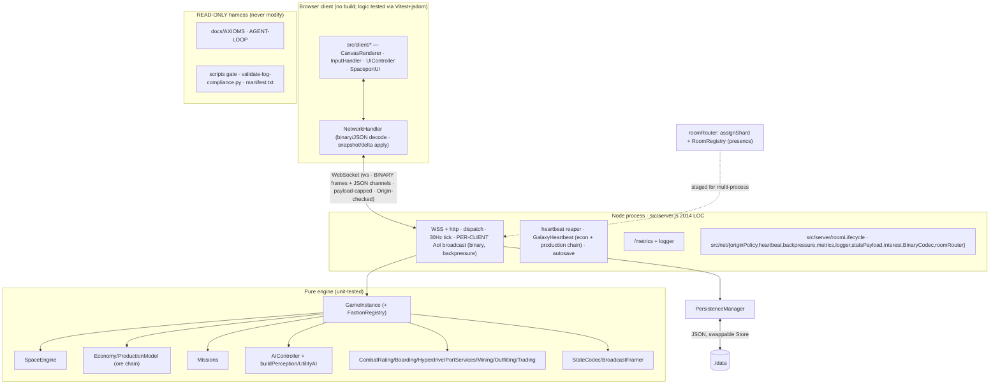

# ROADMAP — Audit-Driven Development Blueprint (v3 · 2026-05-30)

Refreshed after the **entire v2 blueprint shipped** — Phase 0 (`001–006`), Phase 1 (`007–013`), Wave A
(`020–025`), and all of Phase 2 (`014–019`) are **DONE and green**. This is the **execution order** for the
next cycle. Atomic work lives in [`specs/`](specs/); status in [`PROGRESS.md`](PROGRESS.md); runtime rules
in [`AGENTS.md`](AGENTS.md). Product North Star + pillars (P1–P8): [`../docs/GOAL.md`](../docs/GOAL.md).

> **What changed since v2:** the repo went from 614 tests / 42 suites (netcode/sim features unbuilt) to
> **696 Jest tests / 51 suites + 17 client tests, 0 CVEs**, now shipping per-client **interest management**
> (AoI), a **binary wire protocol** (key-dictionary codec), **faction runtime wiring** (standings drive
> prices + NPC targeting + docking), **goal-driven NPCs** (UtilityAI advisor), a **production chain** (raw
> `ore` → refined goods), a **client test harness** (Vitest+jsdom), an **engine typecheck gate** (scoped),
> a **CI Node LTS matrix**, and the **horizontal-scaling first slice** (router + shared-store proof +
> decomposition). The remaining work is a **continued-hardening / 2026-modernization** wave, a set of
> **debt-paydown** items surfaced by this re-audit + `BACKLOG.md`, and the **scaling build-out** (`019b–f`)
> plus competitive features.

---

## REPO BASELINE (measured 2026-05-30, HEAD `ac7461b` on `main`)

**Core purpose.** `Starfall: Living Galaxy` — a browser-native, authoritative-server **multiplayer space
trading & combat sim**, inside a self-directed autonomous-engineering harness.

| Dimension | Value |
| --- | --- |
| Runtime | Node.js (ESM, `engines >=20`; **Active LTS = Node 24**, Maintenance = 22, **Current = 26**, Node 20 ≈ EOL) |
| Server | `ws` 8.21 + `http` (`src/server.js`, **2,014 LOC**; partially extracted) + `src/server/*`, `src/net/*` (11 modules) |
| Client | Vanilla JS + Canvas 2D (`src/main.js`, `src/client/*`), no framework/bundler/TS |
| Engine | Pure/headless, fully unit-tested: `src/engine` (24) + `engine/ai` (3), `src/physics`, `src/net`, `src/persistence` |
| Netcode | snapshot/delta (`StateCodec`) + per-client **AoI** (`interest.js`) + **binary** wire (`BinaryCodec`) + `BroadcastFramer`; `roomRouter` (shard/registry) for scale |
| Data | JSON-file persistence (`JsonFileStore` → `./data`; swappable `Store`), in-memory rooms; **no DB** |
| Build | none (static + node) · **Typecheck:** `tsc --noEmit` checkJs over `src/net|physics|server` (engine ratchet pending) |
| Tests | Jest **30.4** = **696 / 51 suites**; Vitest+jsdom **17 client**; `npm run test:client` separate |
| Lint/format | ESLint **10.4** (flat) + Prettier, clean. Gate: `npm run agent:check` (= prettier + eslint + typecheck + jest) |
| Security | `npm audit` **0 vulnerabilities**; ws payload-capped + Origin-checked + heartbeat + backpressure; ws `^8.21` > CVE-2026-45736 floor (8.20.1) |
| Observability | `GET /metrics` (counters/gauges/observations) + structured JSON logger |
| CI | `.github/workflows/ci.yml` — prettier → eslint → typecheck → jest on **Node 20/22/24** + a separate `client-tests` job |
| Scale (LOC) | 16.1k src JS / 10.4k test JS · 51 modules · 53 test files |

**Architecture (monolith, single process, multi-room; scaling primitives staged):**

**Operational-health findings (this re-audit):**
- ✅ **Resolved since v2:** AoI filtering, binary protocol, faction wiring, goal-driven NPCs, ore production
  chain, client test harness, typecheck gate (scoped), CI LTS matrix, scaling first slice.
- ⚠️ **`server.js` grew back to 2,014 LOC** — the faction/AoI/binary wiring re-thickened the monolith;
  more message handlers remain inline/untested (`specs/034`).
- ⚠️ **Typecheck covers only `net|physics|server`** — `src/engine` + `src/persistence` are unchecked
  (~70 JSDoc findings); ratchet pending (`specs/030`).
- ⚠️ **Client visual/canvas layer still untested** — 021 covered NetworkHandler/UIController *logic* via
  jsdom; CanvasRenderer/InputHandler/SpaceportUI/main.js have **no** browser/visual tests (`specs/035`).
- ⚠️ **Known latent bug (BACKLOG):** `UIController._updateCombatFeedback` hit-flash classifier — the
  `"armor"` branch is unreachable, so armor hits flash the shield vignette (`specs/028`).
- ⚠️ **Node 20 in CI is ≈EOL** (Apr 2026) while 26 is Current — matrix should move to 22/24/26 (`specs/026`).
- ⏳ **Scaling is a first slice only:** real multi-process / Redis is unbuilt (`specs/019b–019f`); and there
  is no matchmaking-with-filters or wire compression yet (`specs/036–038`).
- 🐛 **BACKLOG carry-overs:** mission/trade faction standings + reputation decay, UtilityAI advisor rollout,
  `COMMODITIES` centralization (see `BACKLOG.md`).

---

## RESEARCH SYNTHESIS (2026 · web-verified this cycle)

- **Node.js (2026):** Active LTS = **Node 24**; Maintenance = **22**; **Node 26** is Current (released
  2026-05-05, enters LTS Oct 2026); **Node 20 reaches EOL ~Apr 2026**. Production must run an LTS — drop 20
  from CI, move to **22/24/26**, bump the floor to `>=22` (`specs/026`).
- **`ws` security:** **CVE-2026-45736** — uninitialized-memory disclosure in `websocket.close()` with a
  TypedArray `reason`; **fixed in ws 8.20.1**. The repo's `^8.21.0` is already above the floor (`npm audit`
  clean) — document/pin the floor so a future downgrade can't regress it (`specs/027`). The Next.js
  WebSocket-upgrade SSRF (CVE-2026-44578) doesn't apply (no Next.js) but reinforces the existing
  Origin/upgrade hardening.
- **Competitive landscape — Colyseus** is the Node.js authoritative-multiplayer reference: "state sync that
  just works — delta-compressed **and binary-encoded**", **room-based matchmaking** with filtering/queuing,
  reconnection. Starfall has now **converged** on the delta+binary+room core; the remaining gaps vs the
  market leader are **matchmaking with room filters/queue** (`specs/036`) and a **schema-based** state
  encoding (`specs/038`). geckos.io (WebRTC/UDP) and Hathora (serverless rooms) remain alternative paths.
- **Client testing — Vitest Browser Mode** (real Chromium via the Playwright provider; shared context,
  ~30% faster than classic Playwright E2E) is the 2026 standard for **canvas/WebGL/computed-style** tests —
  exactly the layer 021 deferred. Add it as a **separate CI job** (`--with-deps`, `headless:true`, ~30s
  timeout, `maxWorkers:4`) for CanvasRenderer visual-regression (`specs/035`).
- **Wire compression — permessage-deflate:** ws disables it server-side by default; it trades CPU/memory
  (Node zlib fragments memory at high concurrency) for size. Since AoI + binary already shrank the payload,
  treat compression as **benchmark-behind-a-flag**, not a default (`specs/037`).
- **Horizontal scaling pattern:** worker processes (~50–100k conns each) + **Redis pub/sub** for cross-node
  broadcast, **sharded pub/sub (Redis 7+ `SPUBLISH`/`SSUBSCRIBE`)** to keep messages on-shard, **NGINX/
  HAProxy `least_conn`** sticky LB, and a Redis-backed client→server presence map — directly validating the
  `019b–f` decomposition in [`specs/019a_scaling_decomposition.md`](specs/019a_scaling_decomposition.md).

---

## EXECUTION WAVES (v20)

Completed waves (`001–088`) are recorded DONE in `PROGRESS.md`. The live work for the current wave:

### Phase 0 — Quick Wins & Safety — `089`, `090`
- `089` Zero-Trust WebSocket Input Schema Validation & Sanitization (construct a performant zero-dependency input schema validator for all websocket commands to prevent prototype pollution and corrupt parameter attacks).
- `090` Event-Loop Latency Monitoring & Backpressure Load-Shedding (track real-time event-loop delays and dynamically drop non-essential message broadcasts under high process load).

### Phase 1 — Core Upgrades & Feature Delivery — `091`
- `091` Authoritative Game Invariant Verifier & Heartbeat Self-Healing Loop (periodically check system credits, cargo limits, coordinates, and outfitting slots, automatically correcting anomalies to protect state integrity).

---

## EXECUTION WAVES (v21)

Completed waves (`001–089`) are recorded DONE in `PROGRESS.md`. The sandbox infrastructure wave:

### Phase 0 — Security & Teardown Lifecycle — `092`, `093`
- `092` Automated Zombie Process Reaper & Orphan Port Cleanup Subsystem (build a modular ProcessReaper class tracking worker threads/child processes and a PowerShell teardown script to kill orphaned tasks and free locked socket ports).
- `093` State Leakage Defender & Workspace Isolation Sandbox (develop an automatic workspace sanitizing script to detect and sweep untracked test directories and local temp logs while preserving planning ledgers).

### Phase 2 — Observability & Telemetry — `094`
- `094` LLM Observability & Sandbox Resource Telemetry Recorder (implement sandbox-level memory, CPU, and disk utilization recording to log resource leaks and plot peak footprints on the telemetry dashboard).

---

## EXECUTION WAVES (v22)

Completed waves (`001–094`) are recorded DONE in `PROGRESS.md`. The advanced load & cost sentinel wave:

### Phase 0 — Adv Evals & Load Scaling — `095`
- `095` High-Concurrency Sandbox Stress-Testing & Simulated Network Latency Injector (build application-level latency/drop injector and concurrent headless load runner simulating 50+ concurrent pilots clashing in sectors).

### Phase 1 — Observability & Universe History — `096`
- `096` The Galactic Chronicle & Dynamic persistent simulation history logs (record major econ spikes and faction stand-off results in pruned JSON store and display on neon timeline sidebar).

### Phase 2 — Security & Cost Sentinel — `097`
- `097` Sandboxed Outbound API Rate Limiter & Network Domain Sentinel (protect host budgets via sliding-window limiters wrapping external AI prompts, returning warning mocks and blocking non-allowlisted egress domains).

---

## EXECUTION WAVES (v23)

Completed waves (`001–097`) are recorded DONE in `PROGRESS.md`. The emergent gameplay and centralized architecture wave:

### Phase 0 — Core Architecture Hardening — `099`
- `099` Centralized Commodities & Unified Schema Registry (centralize commodities configurations and all WebSocket / request command structures into a unified schema registry to prevent client/server drift and validation bugs).

### Phase 1 — Emergent Universe Operations — `098`
- `098` Emergent Faction Territory Control & Dynamic Sector Borders (build dynamic influence tracker shifting sector control, security ratings, and tax rates dynamically based on combat and mission outcomes).

### Phase 2 — Ship Fittings & Loadout UI — `100`
- `100` Ship Fittings Presets & Loadout Manager (build server-persisted outfitting loadout preset manager allowing single-click preset purchases and dynamic slot/power grid safety validation).

---

## MASTER PRIORITIZATION TABLE (next-cycle work)

Scores 1–5 (5 = best). Risk: 5 = low risk. Σ = Impact + Feasibility + Risk + Fit.

| Spec | Title | Phase | Impact | Feasibility | Risk(5=safe) | Fit | Σ |
| --- | --- | :-: | :-: | :-: | :-: | :-: | :-: |
| 099 | Centralized Schema Registry | 0 | 5 | 5 | 5 | 5 | 20 |
| 098 | Emergent Faction Territory | 1 | 5 | 4 | 4 | 5 | 18 |
| 100 | Ship Fittings Preset Manager | 2 | 4 | 4 | 4 | 5 | 17 |

**Recommended start:** `099` (Σ20 — Centralized Commodities & Unified Schema Registry), then proceed to `098` (Σ18 — Emergent Faction Territory Control & Dynamic Sector Borders), and finally `100` (Σ17 — Ship Fittings Presets & Loadout Manager).

## Risks & guardrails
- **Substrate is read-only** (`AGENTS.md §0`) — never modify.
- Client **canvas/visual** is verified using Vitest Browser Mode; keep screenshot tolerances high enough to avoid font/environment flakiness.
- Every spec lands behind a green `npm run agent:check` (+ `npm run test:client` and `npm run test:client:browser`); nothing committed without validation.

